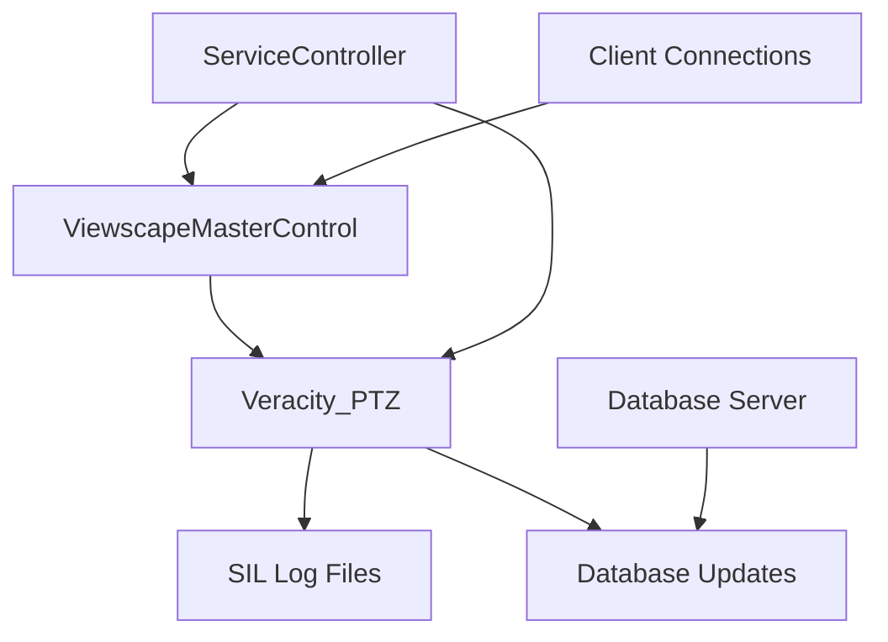

# VERACITY Service Controller - Complete Documentation

## Project Overview

A robust, configurable Windows service controller designed for VERACITY's distributed surveillance system. Monitors services across multiple nodes with intelligent failover, SIL log analysis, and database integration.

## Project Structure

```
veracity_milestone_service/
├── main.py                          # Main orchestrator & entry point
├── .env                            # Database configuration (create this)
├── .env.template                   # Environment template
├── requirements.txt                # Python dependencies
│
├── config/                         # Configuration management
│   ├── __init__.py
│   ├── config_loader.py           # YAML configuration loader
│   └── config.yaml                # Main configuration file
│
├── services/                      # Service monitoring logic
│   ├── __init__.py
│   └── service_checker.py         # Core service checking & management
│
├── db/                           # Database operations
│   ├── __init__.py
│   └── database.py               # SQLAlchemy database connection
│
├── utils/                        # Utilities & SIL processing
│   ├── __init__.py
│   ├── utils.py                  # SIL reader & log processing
│   └── proserver_PTZ-2025-05-13-11-39-52.sil  # Sample SIL file
│
├── logs/                         # Runtime logs (auto-created)
│   └── service_controller.log    # Main application log
│
└── docs/                         # Documentation
    ├── PROJECT_DOCUMENTATION.md  # This file
    ├── TESTING_GUIDE.md          # Testing procedures
    └── DEPLOYMENT_GUIDE.md       # Production deployment
```

## Architecture Overview

### Core Components

1. **ServiceController** (`main.py`)
   - Main orchestrator
   - Thread management
   - Signal handling
   - Startup/shutdown logic

2. **ConfigLoader** (`config/config_loader.py`)
   - YAML configuration parsing
   - Configuration validation
   - Runtime config updates

3. **ServiceChecker** (`services/service_checker.py`)
   - Service monitoring
   - Log file analysis (SIL & text)
   - Database updates
   - Service restart logic

4. **SIL Utils** (`utils/utils.py`)
   - Binary SIL file reading
   - String extraction from SIL logs
   - PTZ-specific log analysis

5. **Database** (`db/database.py`)
   - SQLAlchemy connection management
   - Database health checks
   - SQL Server integration

## Configuration System

### Environment Variables (`.env`)

```bash
# Database Configuration
DB_DRIVER=ODBC Driver 17 for SQL Server
DB_SERVER=VERACITY-SQL-SERVER
DB_DATABASE=VeracityDB
DB_USERNAME=service_user
DB_PASSWORD=secure_password
DB_TRUST_CERT=yes
```

### Main Configuration (`config/config.yaml`)

```yaml
# Cluster Configuration
cluster:
  name: "VERACITY-CLUSTER"
  role_name: "ViewScape-Master"
  default_primary_node: "VERACITY-APPV1"
  nodes:
    - name: "VERACITY-APPV1"
      ip: "***.**.**.56"
    - name: "VERACITY-APPV2"
      ip: "***.**.**.57"

# ViewScape Master Service
viewscape:
  service_name: "ViewscapeMasterControl"
  ports: [500, 12345]
  connection_timeout: 5

# Services to Monitor
services:
  - name: "Veracity_PTZ"
    log_enabled: true
    log_path: "C:/Work/Veracity/logs/proserver_PTZ-latest.sil"
    sil_file: true
    checks:
      - find_string: "Log started"
        action: "find_last"
      - find_string: "CreateNewPTZIntance"  # Note: actual string in your logs
        action: "find_after_previous"
        search_lines: 25
    database_updates:
      - table: "MySettings_TBL"
        set_column: "mysValue_TXT"
        set_value_template: "{machine_ip}"
        where_condition: "mysName_TXT LIKE '%MilestonePTZServerTarget%'"

# System Settings
settings:
  check_interval: 30              # Service check interval (seconds)
  service_restart_timeout: 60     # Service restart timeout
  log_encoding: "utf-8"          # Log file encoding
  max_log_lines_to_check: 1000   # Max log entries to analyze

# Logging Configuration
logging:
  level: "INFO"                   # DEBUG, INFO, WARNING, ERROR
  file_path: "logs/service_controller.log"
  max_file_size: 10485760        # 10MB
  backup_count: 5
  format: "%(asctime)s - %(name)s - %(levelname)s - %(message)s"
```

## Service Distribution & Architecture

### Node Roles

#### VERACITY-APPV1 (Primary - ***.**.**.56)
- **Primary ViewScape Master**: `ViewscapeMasterControl` service runs here
- **PTZ Services**: `Veracity_PTZ` service runs here
- **Database Access**: Primary database connection
- **Ports Open**: 500, 12345 (ViewScape communication)

#### VERACITY-APPV2 (Fallback - ***.**.**.57)
- **Standby ViewScape**: Can run `ViewscapeMasterControl` if primary fails
- **Backup Services**: Can host `Veracity_PTZ` if needed
- **Database Access**: Same database, different connection
- **Ports Open**: 500, 12345 (ready for failover)

### Service Dependencies



## Failover Scenarios

### Scenario 1: Primary Node Healthy
```
VERACITY-APPV1 (Primary)           VERACITY-APPV2 (Standby)
├─ ViewscapeMasterControl ✅       ├─ ViewscapeMasterControl ❌
├─ Veracity_PTZ ✅                 ├─ Veracity_PTZ ❌
├─ Ports 500,12345 ✅             ├─ Ports 500,12345 ❌
└─ Service Controller ✅           └─ Service Controller ✅ (monitoring)
```

### Scenario 2: ViewscapeMasterControl Fails on Primary
```
VERACITY-APPV1 (Primary)           VERACITY-APPV2 (Fallback)
├─ ViewscapeMasterControl ❌       ├─ ViewscapeMasterControl ✅ (AUTO-START)
├─ Veracity_PTZ ⚠️                 ├─ Veracity_PTZ ✅ (MOVED)
├─ Ports 500,12345 ❌             ├─ Ports 500,12345 ✅
└─ Service Controller ✅           └─ Service Controller ✅ (now primary)
```

### Scenario 3: Primary Node Complete Failure
```
VERACITY-APPV1 (Primary)           VERACITY-APPV2 (Fallback)
├─ ALL SERVICES ❌                 ├─ ViewscapeMasterControl ✅
├─ NETWORK UNREACHABLE ❌          ├─ Veracity_PTZ ✅
├─ Ports 500,12345 ❌             ├─ Ports 500,12345 ✅
└─ Service Controller ❌           └─ Service Controller ✅ (primary)
```

## Service Controller Logic Flow

### 1. Startup Sequence
```
1. Load config.yaml & .env
2. Validate configuration
3. Test database connection
4. Discover active ViewScape node
5. Initialize service monitoring
6. Start monitoring thread
```

### 2. Monitoring Loop (Every 30s)
```
1. Check ViewScape ports (500, 12345) on known nodes
2. Identify active ViewScape master
3. For each configured service:
   a. Check Windows service status
   b. Read & analyze SIL/log files
   c. Perform configured log checks
   d. Update database if needed
   e. Restart service if checks fail
4. Log results & sleep until next interval
```

### 3. PTZ Service Check Logic
```
1. Read SIL file: proserver_PTZ-*.sil
2. Find last "Log started" entry
3. Search next 25 lines for "CreateNewPTZIntance"
4. If NOT found:
   a. Update MySettings_TBL with current machine IP
   b. Restart Veracity_PTZ service
   c. Log restart reason
5. If found: Log "service healthy"
```

## Database Integration

### Tables Updated
- **MySettings_TBL**: Service configuration settings
  - Column: `mysValue_TXT` (IP address of active service)
  - Condition: `mysName_TXT LIKE '%MilestonePTZServerTarget%'`

### Update Triggers
- Service restart events
- Node failover events
- Service health check failures

### Template Variables
- `{machine_ip}`: Current machine's IP address
- `{machine_name}`: Current machine hostname
- `{active_node}`: Currently active ViewScape node IP

## Command Line Interface

### Basic Commands
```bash
# Start service controller (production)
python main.py

# Generate default configuration
python main.py config

# Test configuration & connections
python main.py test

# Check current status
python main.py status
```

### Testing & Debugging
```bash
# Test SIL file reading
python utils/utils.py Veracity_PTZ

# Test with specific service
python utils/utils.py [service_name]

# Debug mode (edit config.yaml logging.level = "DEBUG")
python main.py
```

## Installation & Setup

### 1. Prerequisites
```bash
# Python 3.8+ with pip
# SQL Server ODBC Driver 17
# Windows service management permissions
```

### 2. Installation Steps
```bash
# 1. Clone/copy project files
cd C:\Veracity\ServiceController

# 2. Install Python dependencies
pip install -r requirements.txt

# 3. Configure environment
cp .env.template .env
# Edit .env with your database settings

# 4. Configure services
cp config/config.yaml.template config/config.yaml
# Edit config.yaml with your specific paths and IPs

# 5. Test setup
python main.py test

# 6. Run controller
python main.py
```

### 3. Windows Service Installation (Production)
```bash
# Using NSSM (Non-Sucking Service Manager)
nssm install "VeracityServiceController" "C:\Python39\python.exe"
nssm set "VeracityServiceController" AppParameters "C:\Veracity\ServiceController\main.py"
nssm set "VeracityServiceController" AppDirectory "C:\Veracity\ServiceController"
nssm set "VeracityServiceController" DisplayName "VERACITY Service Controller"
nssm start "VeracityServiceController"
```

## Monitoring & Logging

### Log Files
- **Main Log**: `logs/service_controller.log`
  - Service controller events
  - Cluster discovery
  - Service health checks
  - Database updates
  - Error conditions

- **SIL Analysis**: Debug level logging shows:
  - SIL file reading progress
  - String extraction results
  - PTZ marker detection
  - Service health decisions

### Log Levels
- **DEBUG**: Detailed SIL parsing, all checks
- **INFO**: Service status, restarts, cluster changes
- **WARNING**: Failed checks, degraded conditions
- **ERROR**: Service failures, database errors

### Sample Log Output
```
2024-01-15 10:30:00,123 - ServiceController - INFO - VERACITY SERVICE CONTROLLER STARTING
2024-01-15 10:30:00,234 - ServiceController - INFO - Cluster: VERACITY-CLUSTER
2024-01-15 10:30:00,345 - ServiceController - INFO - Connected to active node: ***.**.**.56
2024-01-15 10:30:30,456 - ServiceController - INFO - Checking service: Veracity_PTZ
2024-01-15 10:30:30,567 - ServiceController - INFO - Log check result for Veracity_PTZ: passed - All log checks passed
2024-01-15 10:30:30,678 - ServiceController - INFO - Service check completed: 1/1 successful
```

## Security Considerations

### Database Access
- Use dedicated service account with minimal privileges
- Encrypt connection strings
- Implement connection pooling
- Use parameterized queries

### File System Access
- Read-only access to SIL log files
- Write access to application log directory
- Service restart requires appropriate Windows permissions

### Network Security
- ViewScape ports (500, 12345) should be restricted to cluster nodes
- Database connections should use encrypted channels
- Service controller should run with least privilege

## Performance Tuning

### Large SIL Files
```yaml
settings:
  max_log_lines_to_check: 500    # Reduce for large files
  check_interval: 60             # Increase interval for heavy loads
```

### Memory Optimization
- SIL files are read in chunks
- String extraction is memory-efficient
- Log file caching prevents re-reading unchanged files

### Database Optimization
- Use connection pooling
- Minimize database updates
- Implement retry logic for transient failures

## Troubleshooting Guide

### Common Issues

#### 1. "No active ViewScape node found"
**Cause**: ViewscapeMasterControl not running or ports blocked
**Solution**: 
- Check if ViewscapeMasterControl service is running
- Verify ports 500 and 12345 are open
- Check network connectivity between nodes

#### 2. "SIL file not found" 
**Cause**: Incorrect SIL file path or file rotation
**Solution**:
- Verify SIL file path in config.yaml
- Check if SIL files are being rotated (date-stamped)
- Update log_path to current SIL file

#### 3. "Database connection failed"
**Cause**: Incorrect credentials or SQL Server issues
**Solution**:
- Test connection with `python main.py test`
- Verify .env file settings
- Check SQL Server availability

#### 4. "Service restart failed"
**Cause**: Insufficient permissions or service dependencies
**Solution**:
- Run as Administrator
- Check service dependencies
- Verify service name in config.yaml

### Debug Mode
```yaml
logging:
  level: "DEBUG"  # Enable detailed logging
```

### Health Checks
```bash
# Quick health check
python main.py status

# Test specific service SIL file
python utils/utils.py Veracity_PTZ

# Database connectivity test
python main.py test
```

## License & Support

**Internal Use Only - VERACITY Systems**

For technical support:
- Check logs in `logs/service_controller.log`
- Run diagnostic commands above
- Review configuration files
- Contact VERACITY Engineering team
